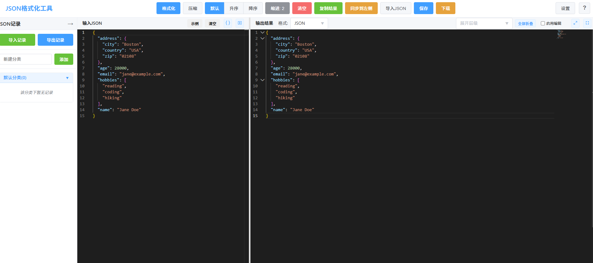
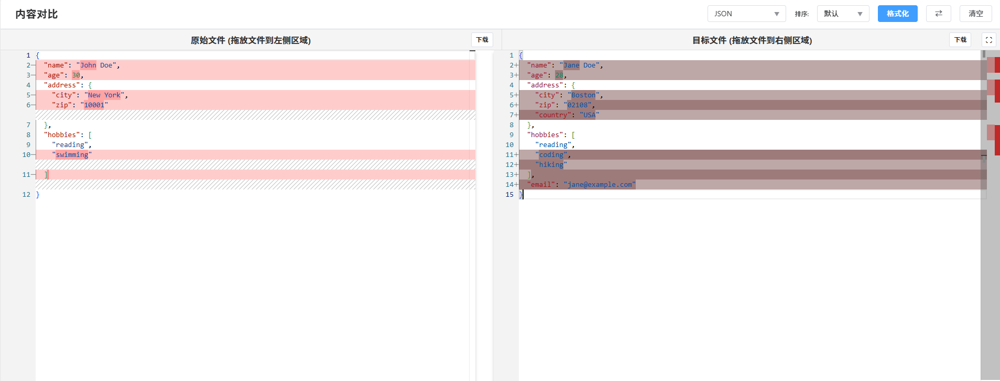

# DevHelper - 前端开发者的超级助手

**浏览器扩展 | 专为前端开发者与职场人士设计**

## 一、核心定位

一款以JSON处理为核心，兼顾多格式转换与高效操作的开发辅助工具，旨在提升前端开发者数据处理效率。

## 二、主要功能

- **JSON核心处理**：格式化（混乱JSON转易读格式）、压缩（移除空格换行减小体积）、排序（支持键名默认/升序/降序）、缩进调整（自定义缩进大小）

- **高效操作工具**：一键清空左侧输入区、一键复制格式化结果、本地数据库保存当前JSON

- **多格式转换**：支持XML/CSV/YAML转JSON，也可将JSON转为上述格式输出；支持拖拽文件（XML/CSV/YAML）自动转换为JSON

- **文件管理**：导入多种格式文件、将处理结果下载为JSON文件

- **个性化设置**：自定义编辑器主题等偏好配置

## 三、使用方法

1. 基础操作：在左侧输入区粘贴/输入JSON文本，点击「格式化」按钮获取结果，按需使用压缩、排序等功能

2. 文件转换：直接将XML/CSV/YAML文件拖拽到页面，自动完成转JSON并格式化

3. 格式切换：通过右上角「输出格式选择器」，切换结果为JSON/XML/CSV/YAML

4. 数据留存：点击「保存」按钮将当前JSON存入本地数据库，点击「下载」将结果保存为文件

## 四、常用快捷键

|快捷键组合|功能说明|
|---|---|
|Ctrl+S|快速打开保存对话框|
|Ctrl+滚轮|调整编辑器缩放大小|
|F11 / Ctrl+Shift+F|切换编辑器全屏模式|

微信/QQ：516293816